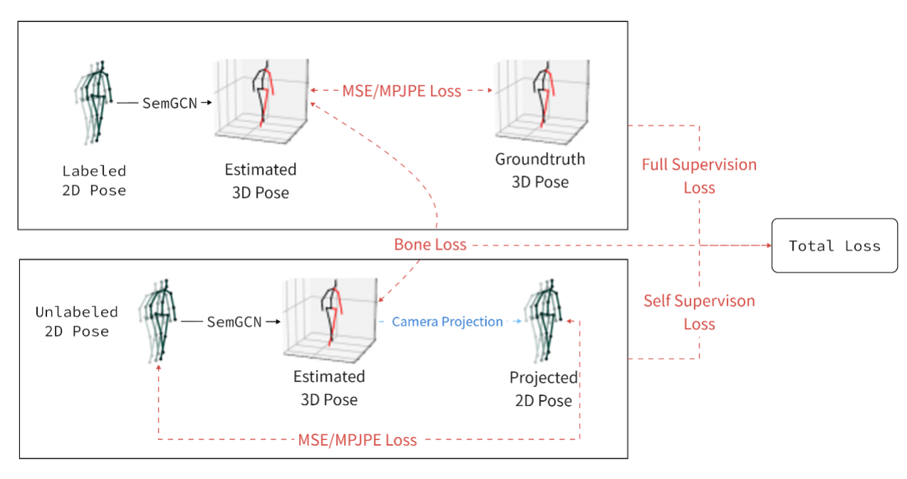

# WS-GCN: Integrating GCN with Weak Supervision for Enhanced 3D Human Pose Estimation (ICCAI 2024 Under Review)

This repository holds the Pytorch implementation of [WS-GCN: Integrating GCN with Weak Supervision for Enhanced 3D Human Pose Estimation](https://github.com/RoyMikeJiang/WSGCN) by [Jiang Zhenxiang](https://github.com/RoyMikeJiang/), [Chen Yingyu](https://github.com/littlecyy/).

 

 

## Introduction
Precisely estimating the 3D human pose is an important and challenging goal in computer vision domain. This topic has improved significantly with the advent of deep learning paradigms and graph convolutional networks (GCNs), especially in the context of contextualizing and analyzing human motion from visual input. This study offers a novel strategy that combines the structural stability of GCNs with the robustness of weakly supervised learning techniques to address the fundamental challenges of 3D human pose estimation, which is closely related to the scarcity of large 3D in-the-wild datasets and the difficulties involved in modeling 3D spatial data. The novel WS-GCN model, a weakly-supervised semantic graph convolutional neural network, is the central component of our proposal. By building a semantic graph, this model is able to represent the complex semantic and spatial relationships between anatomical joints. With the integration of a non-local layer, WS-GCN greatly improves the accuracy of projecting 2D coordinates into 3D space. The effectiveness of our methodology is demonstrated by empirical evaluations, especially when combined with a bone length penalty and a fully-supervised training warm-up stage. In combination, these improvements strengthen the model's performance when it comes to weakly supervised domains. The model demonstrates quantitative performance under full supervision, with a Mean Per Joint Position Error (MPJPE) of 41.95 mm and a Procrustes-aligned MPJPE (P-MPJPE) of 33.40 mm. Under the weakly supervised conditions, the model attains the MPJPE of 49.23 mm and the P-MPJPE of 39.88 mm. Significantly, this model  scored third in the overall domain of weakly supervised 3D human pose estimation on the Human3.6M dataset and attained SOTA in the single view, single frame weakly-supervised 3D human pose estimation on the dataset. This work not only represents an important step forward in the field of 3D human pose estimation, but it also lays out a foundation for further research and possible uses in related fields like virtual reality and interactive computing.

### Results on Human3.6M

Compared results between full supervision and weak supervision.
| Supervision | Bone Loss | Warmup | MPJPE | P-MPJPE |
|:-------|:-------:|:-------:|:-------:|:-------:|
| Full | \ | \ | 41.95 mm | 33.40 mm |
| Weak | No | Yes | 53.16 mm | 43.77 mm |
| **Weak** | **Yes** | **Yes** | **49.23 mm** | **39.88 mm** |
| Weak | Yes | No | 63.50 mm | 52.14 mm |

Ranking information of single-frame single-view weakly-supervised 3D human pose estimation on Human3.6M. Datasource: [paperwithcode: Weakly-supervised 3D Human Pose Estimation on Human3.6M](https://paperswithcode.com/sota/weakly-supervised-3d-human-pose-estimation-on)
| Network | Data View | Frame/Sequence | MPJPE |
|:-------|:-------:|:-------:|:-------:|
| AdaptPose | Single | Sequence | 42.5 mm |
| HDVR | Single | Sequence | 47.3 mm |
| **WS-GCN** | **Single** | **Frame** | **49.23 mm** |
| PGNIS | Single | Frame | 50.8 mm |
| MetaPose | Multi | Frame | 56.0 mm |
| PoseAug | Single | Frame | 56.7 mm |

### References

[1] Martinez et al. [A simple yet effective baseline for 3d human pose estimation](https://arxiv.org/pdf/1705.03098.pdf). ICCV 2017.

[2] Pavllo et al. [3D human pose estimation in video with temporal convolutions and semi-supervised training](https://arxiv.org/pdf/1811.11742.pdf). CVPR 2019.

[3] Long Zhao et al. [Semantic Graph Convolutional Networks for 3D Human Pose Regression](https://arxiv.org/abs/1904.03345). CVPR 2019.

## Acknowledgement

Part of our code is borrowed from the following repositories.

- [3d-pose-baseline](https://github.com/una-dinosauria/3d-pose-baseline)
- [3d_pose_baseline_pytorch](https://github.com/weigq/3d_pose_baseline_pytorch)
- [VideoPose3D](https://github.com/facebookresearch/VideoPose3D)
- [SemGCN](https://github.com/garyzhao/SemGCN)

We thank to the authors for releasing their codes. Please also consider citing their works.